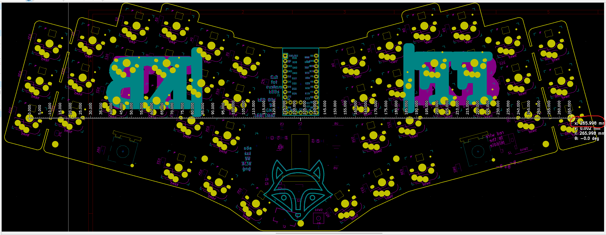
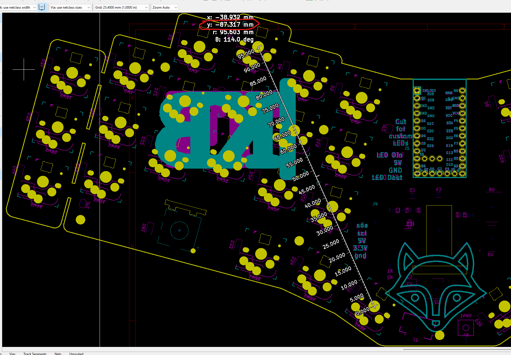
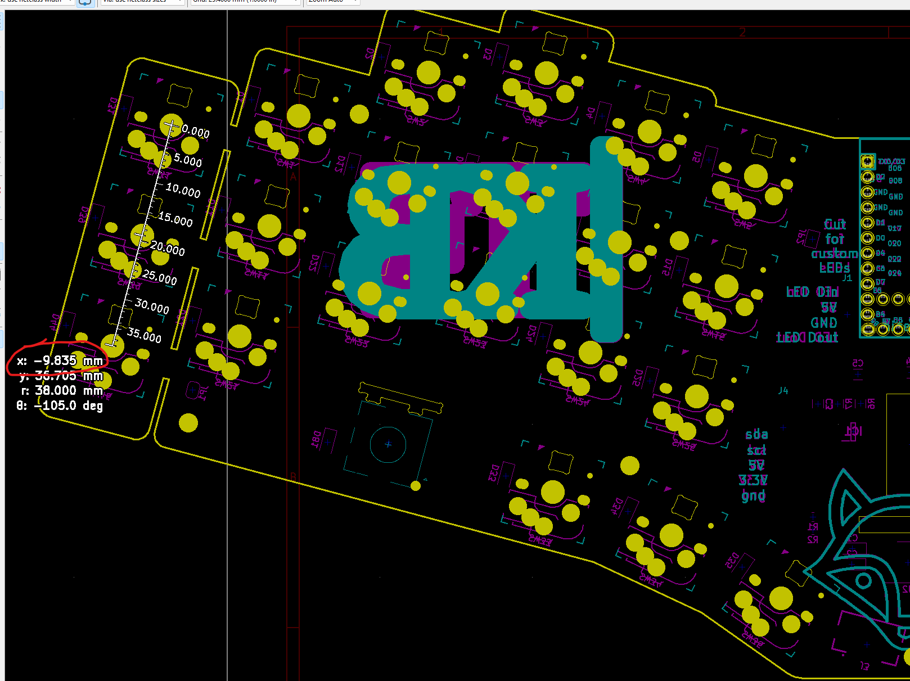
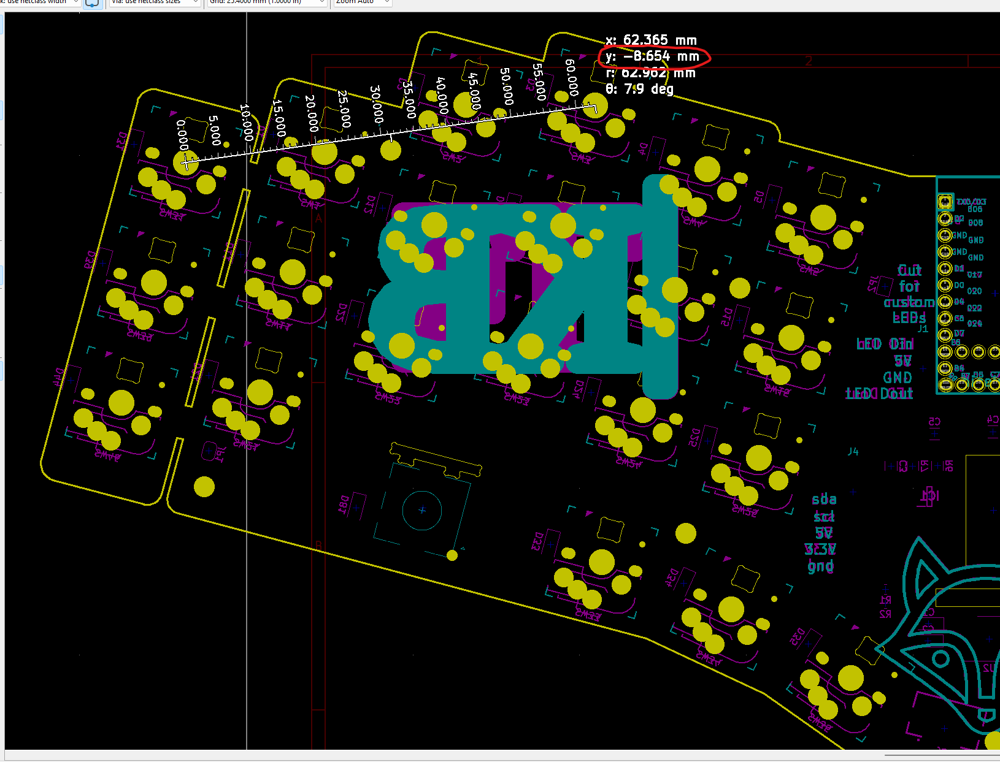
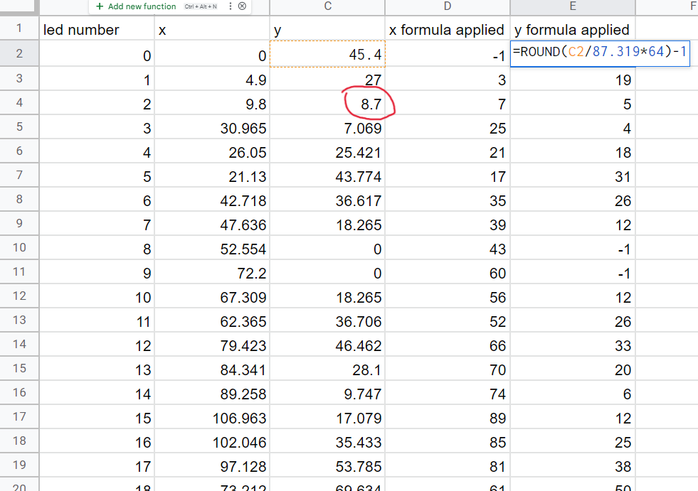

# QMK RGB Matrix configuration

This is a guide to easily calculate the precise numbers required to configure rgb matrix in a way that ensures that the effects are rendered perfectly on your keyboard, no matter the shape, size, key orientation, etc...

## Calculating the values

First and foremost, let's collect all the appropriate values for the x/y coordinates of the leds.

The first step is to set your grid size to the max. This makes it easy to select the footprints at the center when using the measurement tool.


-------------------------------------

Next you'll want to select the measurement tool, and measure from the left most key to the right most key. Take that number and write it down somewhere. You don't need to consider if the number is negative. Just use the absolute value. This applies to all the steps in this whole process.



-------------------------------------

Repeat the same step as above, but measure from the top most key to the bottom most key.



-------------------------------------

Now, this is to highlight what you'll need to do for each key for the X position. Select the left most key, and measure from its center to each key. Copy the X value. 

> Note:  You don't need to do this yet, as this will come after you create the spreadsheet.



-------------------------------------

For the Y position, select the top most key, and measure from its center to each key. Copy the Y value. 

> Note:  You don't need to do this yet, as this will come after you create the spreadsheet.



## The spreadsheet

Create a spreadsheet with 5 columns, as shown below.

`led number`: The number of the led in the series. It's important that you track the order, and measure in order. You will use in QMK firmware. 

`x`: The x distance from the left most key, as measured in the previous step 

`y`: The y distance from the top most key, as measured in the previous step 

`x formula applied`: This is a formula used to translate the raw value to the QMK position. In this example, 266 is the total distance from the left most key to the right most key. This is the number from the fisrt measurement step. The rest of the formula should remain as shown in the screenshot below.

`y formula applied`: Same purpose as the x formula, but for the y value. In this example, 87.319 is the distance from the top most key to the bottom most key, as measured in the second measurement step.


-------------------------------------

 You can see that I circled the x distance value that I measured in the previous step. The example above is the 3rd led in the series, so it went in led number 2 (since I start at 0)


-------------------------------------

 Same comment as above regarding the y value, circled in red



## QMK configuration

With the info in the spreadsheet, you have everything you need to populate the rgb matrix common configuration:
https://github.com/qmk/qmk_firmware/blob/master/docs/feature_rgb_matrix.md#common-configuration-idcommon-configuration

This is the led configuration for the example keyboard above.
* For the first section, you just need to map the key matrix position (in your `KEYBOARD_NAME.h`) to the led number in the series. This is well documented in QMK
* For the second section, this is where the work you did just came in very handy. Go down the list of the spreadsheet you just made, and make a pair for each row in the spreadsheet using the {x formula applied, y formula applied} values
* For the last section, based on the series of the leds, decide whether or not that particular key is a modifier or an alpha. If a modifier, use 1. If an alpha, use 4.

```c
#ifdef RGB_MATRIX_ENABLE
led_config_t g_led_config = { {
    { 2,   8,  14, 9, 15, 26, 27, 3   },
    { 1,   7,  13, 10, 16, 25, 28, 4   },
    { 0,   6,  12, 11, 17, 24, 29, 5   },
    { NO_LED, 31,  33, 35, 37, 36, 39, NO_LED },
    { NO_LED, 30,  34, 32, 38, 41, 40, NO_LED },
    { NO_LED,   23,  19, 18, 20, 21, 22, NO_LED }
}, {
    {0,32},{3,19},{7,5},{25,4},{21,18},{17,31},{35,26},{39,12},{43,0},{60,0},{56,12},{52,26},
    {66,33},{70,20},{74,6},{89,12},{85,25},{81,38},{61,50},{77,55},{93,63},{129,63},{145,55},{161,50},
    {141,38},{137,25},{133,12},{148,6},{152,20},{156,33},{170,26},{166,12},{162,0},{179,0},{183,12},{187,26},
    {205,31},{201,18},{197,4},{215,5},{219,19},{223,32}
}, {
    1, 1, 1, 4, 4, 4, 4, 4, 4, 4, 4, 4,
    4, 4, 4, 4, 4, 4, 1, 1, 1, 1, 1, 1,
    4, 4, 4, 4, 4, 4, 4, 4, 4, 4, 4, 4,
    4, 4, 4, 1, 1, 1
} };

#endif
```

## The end

That's all there is to it! You have now configured your per key rgb to generate perfect effects.
