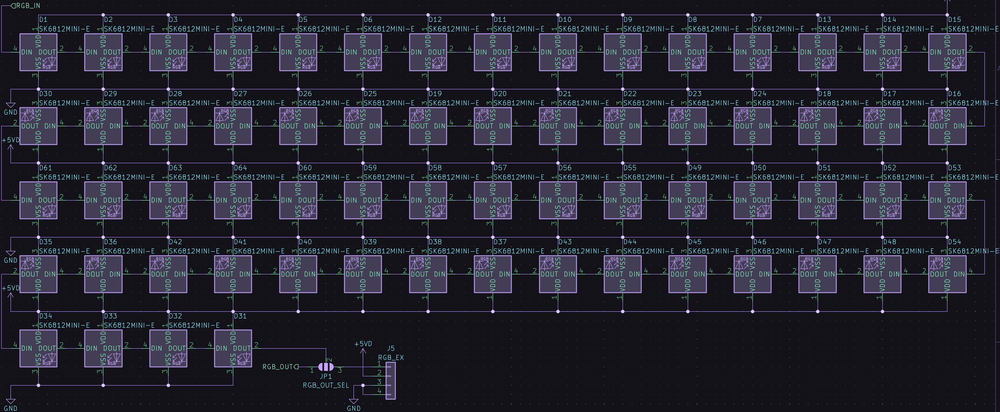
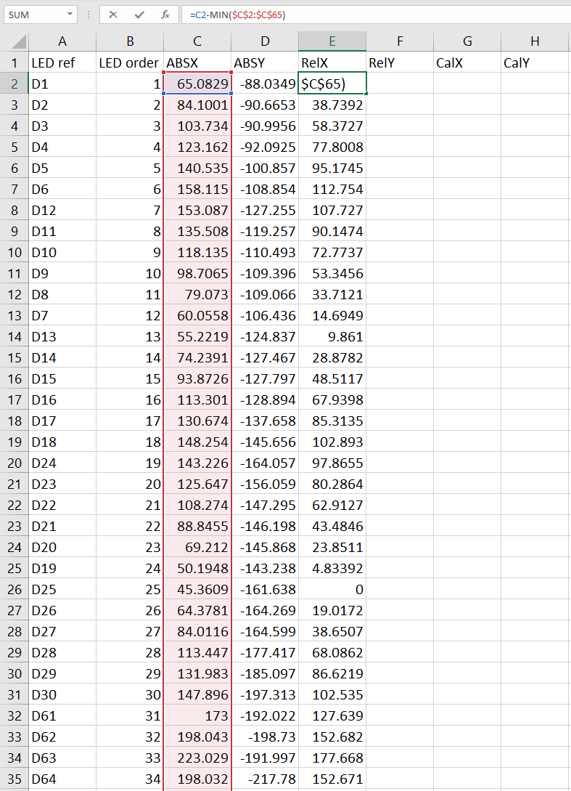
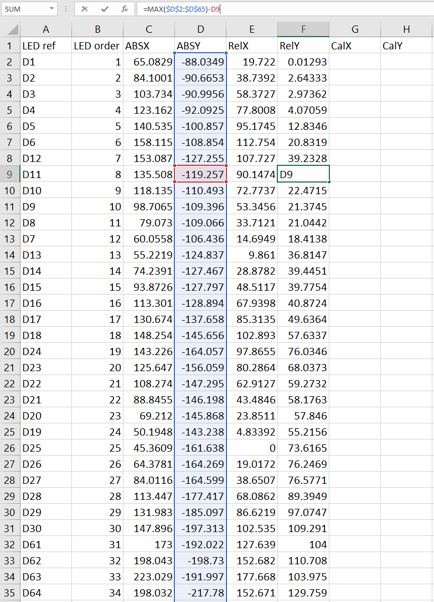
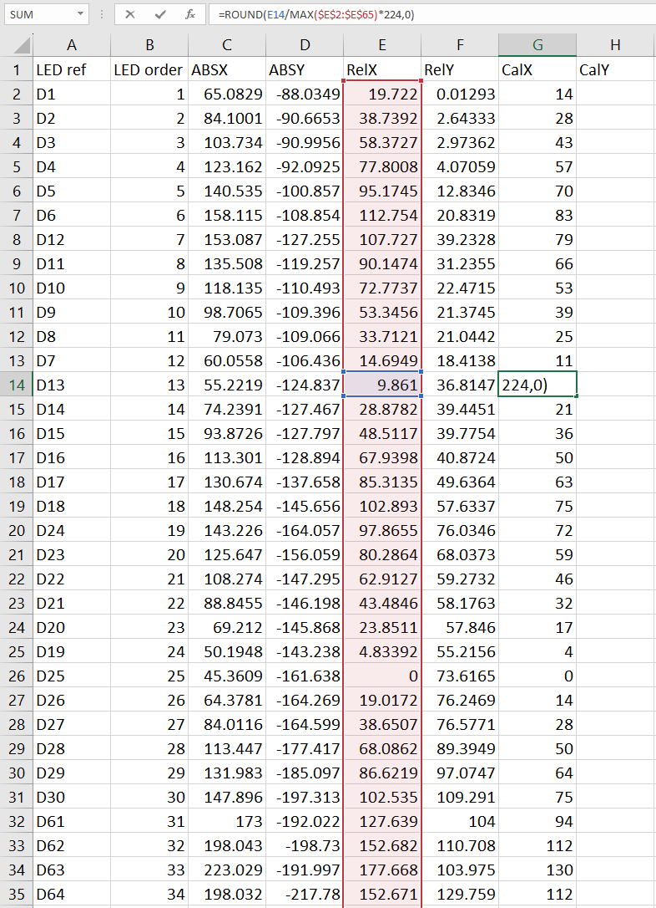
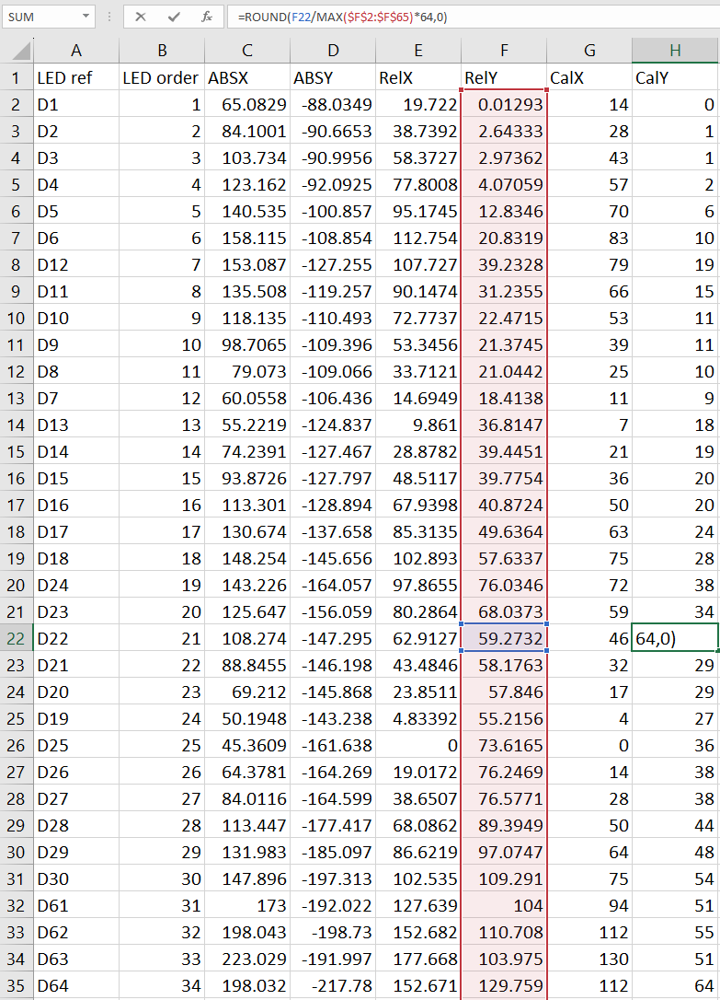
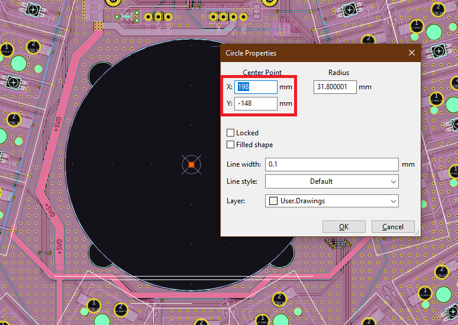

# QMK RGB Matrix configuration

This is a guide to easily calculate the precise numbers required to configure rgb matrix in a way that ensures that the effects are rendered perfectly on your keyboard, no matter the shape, size, key orientation, etc...

## Extracting the values

First and foremost, let's collect all the appropriate values for the x and y coordinates of the leds.

The first step is to get the absolute positions of the LEDs. Kicad, thankfully, has built-in functionality to export the positions of all parts on the board, and here's how to access it.


-------------------------------------

Leave the selections in the popup as they are, as you'll only use the file to calculate the relative position of each LED. To make it easier to find, you can input `POS` or your own choice of folder name into the `Output directory` field.


-------------------------------------

Once you have the pos file generated, open it up. You should see a list of all the parts ordered by the component reference.

> Note: If you want to save the calculations in the excel spreadsheet, don't forget to save it as an excel file instead of a CSV!


## The spreadsheet

Delete everything from the list that isn't an RGB LED. Hopefully, the footprint you've used for them will have a part number that's easily recognizable.

Once you've deleted the extra components, you no longer need the Val, Package, Rot or Side columns so get rid of those too.

Next, create the following columns. Feel free to name them something else as long as you know what each column is for.

`LED ref`: The reference number of each LED. Rename the `Ref` column to this. 

`LED order`: The actual electrical order of each LED. 

`ABSX`: The absolute X position of the LED on the PCB. Rename the `PosX` column to this. 

`ABSY`: The absolute Y position of the LED on the PCB. Rename the `PosY` column to this.

`RelX`: The relative X position of the LED compared to the left-most LED.

`RelY`: The relative Y position of the LED compared to the top-most LED.

`CalX`: The relative X value translated to the QMK X position of the LED.

`CalY`: The relative Y value translated to the QMK Y position of the LED.


> Note: The LED references aren't necessarily going to be in numerical order, as they're ordered in the info.json file by how they're connected electrically. This is why you need the `LED order` column. Refer to your schematic to double-check that the LEDs are ordered correctly!



-------------------------------------

Now to fill in the `RelX` and `RelY` columns.

For the `RelX` column, use the following formula.

`= (ABSX) - MIN (ABSX values)`, which when translated to excel in the example, becomes `=C2-MIN($C$2:$C$65)`.

The range of values in the `MIN($C$2:$C$65)` function reference the `ABSX` column. You need to use the `$` signs in order to keep the referenced cells the same when copying across cells. 



For the `RelY` column, use the following formula.

`= MAX (ABSY values) - (ABSY)`, which when translated to excel in the example, becomes `=MAX($D$2:$D$65)-D9`.

> Note: If your Kicad Y coordinates increase as you go down the screen, use `= (ABSY) - MIN (ABSY values)` instead.



-------------------------------------

QMK has a recommended maximum X value of `224`, and a Y value of `64`. In order to translate the relative values to the QMK values, you need to use the following formulae.

`(CalX) = ROUND[(RelX) / MAX (RelX values) * 224, 0]`, which when translated to excel in the example, becomes `=ROUND(E14/MAX($E$2:$E$65)*224,0)`

`(CalY) = ROUND[(RelY) / MAX (RelY values) * 64, 0]`, which when translated to excel in the example, becomes `=ROUND(F22/MAX($F$2:$F$65)*64,0)`

As you did above, use $ signs when referencing the range of values in the `RelX` and `RelY` columns.




## QMK configuration

With the info in the spreadsheet, you have everything you need to populate the rgb matrix in your info.json file.

Each entry has the following format:

`{ "flags": 1, "matrix": [0, 0], "x": 14, "y": 0 },`

In the above example,

`"flags": 1` defines the type of each LED. Refer to the following table for what each flag means.

|Define                      |Value |Description                                 |
|----------------------------|------|--------------------------------------------|
|`LED_FLAG_MODIFIER`         |`1`   |If the LED is on a modifier key             |
|`LED_FLAG_UNDERGLOW`        |`2`   |If the LED is for underglow                 |
|`LED_FLAG_KEYLIGHT`         |`4`   |If the LED is for key backlight             |
|`LED_FLAG_INDICATOR`        |`8`   |If the LED is for keyboard state indication |

`"matrix": [0, 0]` if the flag is 1 or 4, this defines the position of the LED relative to the key it's under. If the flag is 2 or 8, omit this field.

`"x": 14, "y": 0 ` defines the physical position of the LED. This is where you want to input your previously calculated `CalX` and `CalY` values.

The following is the RGB matrix configuration for the example PCB above.

```json
    "rgb_matrix": {
        "layout": [
            { "flags": 1, "matrix": [0, 0], "x": 14, "y": 0 },
            { "flags": 4, "matrix": [0, 1], "x": 28, "y": 1 },
            { "flags": 4, "matrix": [0, 2], "x": 43, "y": 1 },
            { "flags": 4, "matrix": [0, 3], "x": 57, "y": 2 },
            { "flags": 4, "matrix": [0, 4], "x": 70, "y": 6 },
            { "flags": 4, "matrix": [0, 5], "x": 83, "y": 10 },
            { "flags": 4, "matrix": [1, 5], "x": 79, "y": 19 },
            { "flags": 4, "matrix": [1, 4], "x": 66, "y": 15 },
            { "flags": 4, "matrix": [1, 3], "x": 53, "y": 11 },
            { "flags": 4, "matrix": [1, 2], "x": 39, "y": 11 },
            { "flags": 4, "matrix": [1, 1], "x": 25, "y": 10 },
            { "flags": 1, "matrix": [1, 0], "x": 11, "y": 9 },
            { "flags": 1, "matrix": [2, 0], "x": 7, "y": 18 },
            { "flags": 4, "matrix": [2, 1], "x": 21, "y": 19 },
            { "flags": 4, "matrix": [2, 2], "x": 36, "y": 20 },
            { "flags": 4, "matrix": [2, 3], "x": 50, "y": 20 },
            { "flags": 4, "matrix": [2, 4], "x": 63, "y": 24 },
            { "flags": 4, "matrix": [2, 5], "x": 75, "y": 28 },
            { "flags": 4, "matrix": [3, 5], "x": 72, "y": 38 },
            { "flags": 4, "matrix": [3, 4], "x": 59, "y": 34 },
            { "flags": 4, "matrix": [3, 3], "x": 46, "y": 29 },
            { "flags": 4, "matrix": [3, 2], "x": 32, "y": 29 },
            { "flags": 4, "matrix": [3, 1], "x": 17, "y": 29 },
            { "flags": 1, "matrix": [3, 0], "x": 4, "y": 27 },
            { "flags": 1, "matrix": [4, 0], "x": 0, "y": 36 },
            { "flags": 1, "matrix": [4, 1], "x": 14, "y": 38 },
            { "flags": 1, "matrix": [4, 2], "x": 28, "y": 38 },
            { "flags": 1, "matrix": [4, 3], "x": 50, "y": 44 },
            { "flags": 1, "matrix": [4, 4], "x": 64, "y": 48 },
            { "flags": 1, "matrix": [4, 5], "x": 75, "y": 54 },
            { "flags": 1, "matrix": [3, 6], "x": 94, "y": 51 },
            { "flags": 1, "matrix": [3, 7], "x": 112, "y": 55 },
            { "flags": 1, "matrix": [3, 8], "x": 130, "y": 51 },
            { "flags": 1, "matrix": [4, 7], "x": 112, "y": 64 },
            { "flags": 1, "matrix": [4, 9], "x": 149, "y": 54 },
            { "flags": 1, "matrix": [4, 10], "x": 160, "y": 48 },
            { "flags": 1, "matrix": [4, 11], "x": 174, "y": 44 },
            { "flags": 1, "matrix": [4, 12], "x": 196, "y": 38 },
            { "flags": 1, "matrix": [4, 13], "x": 210, "y": 38 },
            { "flags": 1, "matrix": [4, 14], "x": 224, "y": 36 },
            { "flags": 4, "matrix": [3, 14], "x": 220, "y": 27 },
            { "flags": 1, "matrix": [3, 13], "x": 206, "y": 29 },
            { "flags": 4, "matrix": [3, 12], "x": 192, "y": 29 },
            { "flags": 4, "matrix": [3, 11], "x": 178, "y": 29 },
            { "flags": 4, "matrix": [3, 10], "x": 165, "y": 34 },
            { "flags": 4, "matrix": [3, 9], "x": 152, "y": 38 },
            { "flags": 4, "matrix": [2, 9], "x": 149, "y": 28 },
            { "flags": 4, "matrix": [2, 10], "x": 161, "y": 24 },
            { "flags": 4, "matrix": [2, 11], "x": 174, "y": 20 },
            { "flags": 4, "matrix": [2, 12], "x": 188, "y": 20 },
            { "flags": 4, "matrix": [2, 13], "x": 203, "y": 19 },
            { "flags": 1, "matrix": [2, 14], "x": 217, "y": 18 },
            { "flags": 1, "matrix": [1, 14], "x": 213, "y": 9 },
            { "flags": 4, "matrix": [1, 13], "x": 199, "y": 10 },
            { "flags": 4, "matrix": [1, 12], "x": 185, "y": 11 },
            { "flags": 4, "matrix": [1, 11], "x": 171, "y": 11 },
            { "flags": 4, "matrix": [1, 10], "x": 158, "y": 15 },
            { "flags": 4, "matrix": [1, 9], "x": 145, "y": 19 },
            { "flags": 4, "matrix": [0, 9], "x": 141, "y": 10 },
            { "flags": 4, "matrix": [0, 10], "x": 154, "y": 6 },
            { "flags": 4, "matrix": [0, 11], "x": 167, "y": 2 },
            { "flags": 4, "matrix": [0, 12], "x": 181, "y": 1 },
            { "flags": 4, "matrix": [0, 13], "x": 196, "y": 1 },
            { "flags": 1, "matrix": [0, 14], "x": 210, "y": 0 }
        ]
    }
```

## RGB Matrix center

> Note: This step is optional, you only need to follow this if you have a specific spot you want the center of your matrix to go.

The default center of the keyboard in QMK is `{ 112, 32 }`, but this can be changed if you want. To calculate this easily, find the absolute point on the PCB where you want to center to go, then treat it as another LED and input it into the spreadsheet, performing the calculations as normal.




## The end

That's all there is to it! You have now configured your per key rgb to generate perfect effects. Reference files are also included in this repository, in case you want to look at the examples referenced in this guide.

## Change Log

* [Aria](https://github.com/ariamelon/) - Aug 7th, 2023 - Updated guide to be more automated using CPL file and updated it to fit current info.json formatting
* Sadek Baroudi - Jan 8th, 2023 - Original guide
